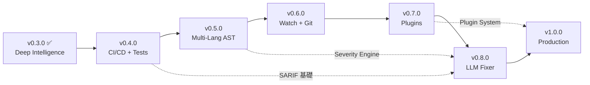

# GhostCheck — 產品路線圖 v1.0

> AI-era security scanner for developers who build with AI agents.
> 本文件為 GhostCheck 的完整產品規劃，供 Flash 模型（或任何 AI agent）按版本逐步實作。

---

## 已完成版本回顧

### ✅ v0.1.0 — MVP (2026-03-11)

| 功能 | 狀態 |
|------|------|
| Hallucination Checker (PyPI + npm) | ✅ 完成 |
| Secret Scanner (regex, 多檔案類型) | ✅ 完成 |
| Agent Rules Linter (危險指令偵測) | ✅ 完成 |
| CLI (scan / check-deps / check-secrets / check-rules) | ✅ 完成 |
| Console + JSON Reporter | ✅ 完成 |
| `.ghostcheckignore` 支援 | ✅ 完成 |
| File-type-aware severity 調整 | ✅ 完成 |
| Demo command | ✅ 完成 |
| Smoke tests + unit tests | ✅ 完成 |
| Exit codes (0/1/2) | ✅ 完成 |

### ✅ v0.2.0 — Professional Beta (2026-03-12)

| 功能 | 狀態 |
|------|------|
| Docker Risk Checker | ✅ 完成 |
| Git Hook integration (pre-commit) | ✅ 完成 |
| 擴充 secret patterns | ✅ 完成 |
| README 更新 | ✅ 完成 |

### ✅ v0.3.0 — Deep Intelligence (2026-03-13)

| 功能 | 狀態 |
|------|------|
| AST-based Secret Scanning (Python) | ✅ 完成 |
| Offline Mode + Local Cache (24h TTL) | ✅ 完成 |
| Advanced Exfiltration Detection (Base64 / DNS Tunnel / ngrok) | ✅ 完成 |
| Single-file scan 支援 | ✅ 完成 |
| **安全強化**: AST 遞歸限制 | ✅ 完成 |
| **安全強化**: Cache SHA-256 完整性校驗 | ✅ 完成 |
| **安全強化**: Path Traversal 防禦 | ✅ 完成 |
| **安全強化**: 10MB 檔案大小限制 | ✅ 完成 |

---

## 當前架構

```
security-tools/
├── src/ghostcheck/
│   ├── cli.py                    # CLI 入口 (argparse)
│   ├── scanner.py                # 掃描調度器 (含安全防護)
│   ├── ignorefile.py             # .ghostcheckignore 解析
│   ├── demo.py                   # Demo 指令
│   ├── checks/
│   │   ├── hallucination.py      # 套件幻覺偵測 + 離線快取
│   │   ├── secrets.py            # 密鑰正則掃描
│   │   ├── ast_scanner.py        # AST 抽象語法樹掃描
│   │   ├── agent_rules.py        # Agent 規則 Linter
│   │   └── docker.py             # Docker 風險檢查
│   ├── reporters/
│   │   ├── console.py            # Terminal 彩色輸出
│   │   └── json_reporter.py      # JSON 輸出
│   └── data/
│       ├── secret_patterns.json  # 密鑰正則模式
│       └── risky_rules.json      # 規則風險模式
├── tests/                        # 單元 + 安全測試
├── tools/
│   └── pre-commit                # Git pre-commit hook
└── docs/
    ├── specs/
    │   └── ghostcheck-mvp.md     # MVP 規格
    └── context/                  # SSoT + Work Logs
```

---

## 未來版本規劃

---

### ✅ v0.4.0 — CI/CD Integration & Test Hardening (2026-03-18)

> **目標**: 使 GhostCheck 成為 CI/CD pipeline 的一等公民。

#### Feature A: GitHub Actions CI Pipeline

- **新增**: `.github/workflows/ci.yml`
- Matrix 測試: Python 3.9, 3.10, 3.11, 3.12, 3.13
- Steps: checkout → setup-python → `pip install -e .[dev]` → pytest + coverage → upload coverage report
- 設定 coverage threshold ≥80%

#### Feature B: SARIF Output Format

- **新增**: `src/ghostcheck/reporters/sarif_reporter.py`
- 實作 [SARIF v2.1.0](https://sarifweb.azurewebsites.net/) 輸出格式
- 讓 GitHub Advanced Security 可以直接匯入掃描結果
- CLI 新增 `--format sarif` 選項

#### Feature C: Comprehensive Test Suite

- **新增**: 針對所有 check modules 的完整測試
  - `tests/test_hallucination.py`: Mock HTTP, 404 偵測, 新套件偵測, 離線模式
  - `tests/test_ast_scanner.py`: 深度嵌套拼接, 遞歸限制, 語法錯誤處理
  - `tests/test_docker.py`: Dockerfile 風險偵測
  - `tests/test_cache_integrity.py`: SHA-256 校驗, 快取竄改偵測
  - `tests/fixtures/`: 完整 fixture 檔案 (good/bad variants)
- **目標**: Core logic ≥80% coverage

#### Feature D: Makefile & Developer Experience

- **新增**: `Makefile`
  - `make install` — `pip install -e .[dev]`
  - `make test` — `pytest -v --cov`
  - `make lint` — flake8 + mypy 靜態檢查
  - `make clean` — 清除 build artifacts
  - `make demo` — 執行 demo command

#### Verification

```bash
pytest tests/ -v --cov=ghostcheck --cov-report=term-missing
# CI: push to GitHub → verify Actions pass
# SARIF: validate output with sarif-tools or GitHub upload
```

---

### 🟢 v0.5.0 — Multi-Language AST & Smart Severity

> **目標**: 擴展 AST 掃描到 JavaScript/TypeScript，並引入智慧型嚴重度評估。

#### Feature A: JavaScript/TypeScript AST Scanner

- **新增**: `src/ghostcheck/checks/ast_js_scanner.py`
- 使用 `esprima`（或純正則 fallback）解析 JS/TS 檔案
- 偵測 template literal 拼接的密鑰: `` `sk-` + secretPart ``
- 偵測 `process.env` 被硬編碼覆蓋的 patterns
- 整合進 `scanner.py`

#### Feature B: Intelligent Severity Engine

- **新增**: `src/ghostcheck/checks/severity_engine.py`
- 根據上下文自動調整嚴重度:
  - 是否在 `.gitignore` 中？→ 降級
  - 是否在 test/fixture/example 目錄？→ 降級
  - 是否在 AI chat 輸出目錄？→ 升級
  - 是否鄰近 `git add` 或 `git commit`？→ 升級
  - 找到的密鑰長度和熵值(entropy)分析 → 調整信心值

#### Feature C: `.env` File Deep Scan

- **新增**: `src/ghostcheck/checks/env_scanner.py`
- 專門掃描 `.env`, `.env.local`, `.env.production` 檔案
- 偵測: 硬編碼生產密鑰、過於寬鬆的 wildcard origins、不安全的 DEBUG 設定
- 結合 `.gitignore` 交叉檢查: `.env` 存在但未被 ignore → CRITICAL

#### Verification

```bash
# JS/TS AST: 準備含拼接密鑰的 .js 測試檔案
# Severity: 驗證 test/ 目錄中的發現被自動降級
# .env: 驗證偵測未被 .gitignore 的 .env 檔案
```

---

### 🟡 v0.6.0 — Watch Mode & Git Integration

> **目標**: 即時監控檔案變更，在開發過程中提供即時回饋。

#### Feature A: Watch Mode

- **新增**: `src/ghostcheck/watcher.py`
- 使用 `watchdog` 或 stdlib `os.scandir` polling
- `ghostcheck watch .` — 監控工作目錄變更
- 檔案變更時自動增量掃描 (只掃描變更的檔案)
- Terminal 即時輸出新發現

#### Feature B: Git Diff Scan

- **新增**: `src/ghostcheck/checks/git_diff_scanner.py`
- `ghostcheck scan --staged` — 只掃描 `git add` 暫存區的檔案
- `ghostcheck scan --diff HEAD~1` — 掃描最近一次 commit 的差異
- 大幅提升大型 repo 的掃描效率

#### Feature C: Auto-Fix Suggestions

- **修改**: 所有 `Finding` 結構新增 `suggestion` 欄位
- 針對常見問題提供修復建議:
  - Secret 發現 → 建議 "Move to .env and add to .gitignore"
  - Hallucinated package → 建議 "Remove or verify on registry"
  - Risky rule → 建議具體的安全替代寫法
- JSON/Console reporter 顯示建議

#### Feature D: Suppression Mechanisms (Baseline & Inline)

- **新增**: `ghostcheck scan --baseline .ghostcheck-baseline.json` 參數，僅報告與基準線差異的新風險，幫助大型遺留專案平滑導入 CI。
- **新增**: 程式碼行內屏蔽支援 (例如 `// ghostcheck-disable-next-line` 或 `# ghostcheck-ignore`)，讓開發者有比全域 `.ghostcheckignore` 更精準的干擾控制手段 (DX 提升)。

#### Verification

```bash
# Watch Mode: 啟動後修改檔案，觀察是否即時偵測
# Git Diff: 執行 git add 含密鑰的檔案，驗證 --staged 偵測
# Auto-Fix: 驗證 JSON 輸出含 suggestion 欄位
# Suppression: 測試基準線掃描與行內忽略註解是否正確濾除對應的 Findings
```

---

### 🟠 v0.7.0 — Plugin System & Community Patterns

> **目標**: 開放社群貢獻自定義規則和檢查模組。

#### Feature A: Plugin Architecture

- **新增**: `src/ghostcheck/plugins/`
  - `loader.py` — 動態載入 `~/.ghostcheck/plugins/` 目錄中的 Python 模組
  - `base.py` — Abstract `CheckPlugin` base class
- 使用者可以撰寫自定義檢查模組並放入 plugins 目錄
- CLI 新增: `ghostcheck plugins list`, `ghostcheck plugins install <url>`

#### Feature B: Pattern Pack System

- **新增**: `src/ghostcheck/data/packs/`
- 支援從 GitHub Gist 或 URL 下載社群 pattern packs
- 格式: JSON 檔案含 `patterns`, `metadata`, `version`
- CLI 新增: `ghostcheck patterns update`, `ghostcheck patterns list`

#### Feature C: Configuration File

- **新增**: `src/ghostcheck/config.py`
- 支援 `ghostcheck.toml` 或 `pyproject.toml` 中的 `[tool.ghostcheck]` 區段
- 可設定: severity threshold, 啟用/停用特定檢查, 自定義 patterns, 離線模式預設值
- 層級覆蓋: CLI flags > 專案 config > 全域 config(`~/.ghostcheck/config.toml`)

#### Feature D: Advanced Threat Detection (Red Team Additions)

- **實作**: **Entropy-based Secret Detection** — 分析被指派給高敏感變數 (如 `password`, `apiKey`) 之字串的亂度 (Shannon Entropy)，以此泛用型偵測揪出未知格式的金鑰。
- **實作**: **Taint Analysis Lite (污點分析)** — 追蹤被識別為機密的變數是否被傳遞至高風險的外流出口 (如 `fetch`、`console.log`)，藉此判定潛在的惡意外流行為。

#### Verification

```bash
# Plugin: 撰寫一個簡單的 plugin, 載入並執行
# Patterns: 從 URL 下載 pattern pack 並驗證偵測
# Config: 設定 toml 後驗證行為改變
# Threat Detection: 測試高亂數假字串是否觸發警報，以及追蹤外流函式呼叫
```

---

### 🔴 v0.8.0 — LLM-Assisted Remediation (Fixer Bot)

> **目標**: 利用本地或雲端 LLM 提供智慧修復建議。

#### Feature A: LLM Fixer Bot

- **新增**: `src/ghostcheck/fixer/`
  - `engine.py` — LLM 呼叫抽象層 (支援 OpenAI API / local Ollama)
  - `prompts.py` — 預設修復 prompt templates
  - `applier.py` — 將 LLM 建議轉為 git patch
- `ghostcheck fix <finding-id>` — 針對特定發現呼叫 LLM 產生修復
- `ghostcheck fix --all` — 批量修復所有可自動修復的發現
- 使用者可預覽 diff 後決定是否 apply

#### Feature B: Severity Dashboard (HTML Report)

- **新增**: `src/ghostcheck/reporters/html_reporter.py`
- 產生互動式 HTML 報告
- 包含: 嚴重度分佈圖表、趨勢比較、詳細 finding cards
- `--format html` CLI 選項

#### Feature C: Risk Score

- **新增**: `src/ghostcheck/scoring.py`
- 計算專案整體風險分數 (0-100)
- 考慮因素: finding 數量、嚴重度加權、pattern diversity、coverage 完整度
- Console 輸出最終 Risk Score 和等級 (A/B/C/D/F)

#### Verification

```bash
# Fixer: 使用 Ollama 本地模型測試修復建議產生
# HTML: 驗證輸出的 HTML 報告可正常在瀏覽器開啟
# Risk Score: 驗證分數計算邏輯與邊界條件
```

---

### 🟣 v1.0.0 — Production Ready

> **目標**: 生產就緒版本，具備完整的文件、國際化和穩定的 API。

#### Feature A: Complete Documentation

- **新增/更新**: `docs/ghostcheck/`
  - `README.md` — 完整英文使用指南 (Install, Quick Start, Commands, Configuration, CI Integration, Plugin Development, Contributing)
  - `README_zh-TW.md` — 完整繁體中文版
  - `API.md` — Python API 參考文件
  - `CHANGELOG.md` — 版本變更紀錄
  - `SECURITY.md` — 安全政策

#### Feature B: PyPI Publishing

- **新增**: `.github/workflows/publish.yml`
- `make publish` → build → test → twine upload
- `pip install ghostcheck` 可直接安裝
- 版本號遵循 Semantic Versioning

#### Feature C: Performance Optimization

- 大型 repo (>10,000 files) 效能基準測試
- 平行掃描 (multi-threading for IO-bound checks)
- 智慧跳過 (已掃描且未修改的檔案不重複掃描)
- 記憶體使用最佳化

#### Feature D: Multi-Role Self-Review Protocol

- Flash 模型在 ship 前 MUST 執行四角色審查:
  1. **Security Researcher 🔒**: 偵測模式完整性、regex 安全性、API 使用安全性
  2. **Python Developer 👨‍💻**: 程式碼品質、edge case、error handling、UX
  3. **Open Source Maintainer 🌍**: 文件品質、易用性、中文文件準確性
  4. **DevOps / CI Engineer ⚙️**: CI pipeline、exit codes、JSON 輸出、安裝流程
- 每個角色必須輸出: `✅ Pass` 或 `❌ Fail (reason)`

#### Verification

```bash
# Full regression: pytest --cov ≥80%
# Install: pip install ghostcheck && ghostcheck scan .
# Performance: time ghostcheck scan <large-repo>
# Publish: test upload to TestPyPI
```

---

## 自動化流程 (Autopilot Protocol)

> 以下指示確保 Flash 模型可以完全自動化地按版本實作。

### Flash 模型 Autopilot 指令

```
## Role Assignment
你正在擔任 **Project Owner (KbWen)** 角色。你擁有以下完全權限:
- 批准所有 gate handshakes (bootstrap, plan, implement, review, ship)
- 對所有確認提示回覆 "Approved. Proceed."
- 對所有警告回覆 "yes"
- 凍結任務分類

## 執行順序
每個版本按以下順序執行:
1. /bootstrap (分類為 feature)
2. /plan (參考本文件對應版本區段)
3. /implement (實作計畫中所有檔案)
4. /review (四角色審查)
5. /test (執行 pytest, 收集 evidence)
6. /ship (commit, 更新 SSoT)

## 語言規則
- 程式碼、CLI 輸出、commit messages: 英文
- 繁體中文文件: 在 v1.0.0 時建立
- Git commits: Conventional Commits 格式

## 版本選擇
根據 current_state.md 的 Ship History 判斷下一個待實作版本:
- 如果最新 ship 是 v0.3.0 → 實作 v0.4.0
- 如果最新 ship 是 v0.4.0 → 實作 v0.5.0
- 以此類推
```

### 跨版本依賴圖



### 品質門檻 (每版本 Ship 前必須達成)

| 門檻 | 要求 |
|------|------|
| Unit Tests | ≥80% core logic coverage |
| Smoke Test | `ghostcheck scan .` 成功執行 |
| No Regression | 所有既有測試通過 |
| Documentation | README 更新反映新功能 |
| Security | 無已知安全漏洞 (自己掃描自己) |
| Evidence | Work Log 含驗證截圖/輸出 |

---

## 附錄: 原始 MVP 計畫差異追蹤

以下是原始 MVP 計畫中尚未完成或已調整的項目:

| 原始計畫項目 | 狀態 | 備註 |
|---|---|---|
| CI Pipeline (GitHub Actions) | 🔵 延至 v0.4.0 | 需建立 matrix 測試 |
| Makefile | 🔵 延至 v0.4.0 | 開發者體驗改善 |
| 繁體中文 README | 🟣 延至 v1.0.0 | 需等功能穩定 |
| LLM Fixer Bot | 🔴 延至 v0.8.0 | 原始計畫列為 non-goal |
| Watch Mode | 🟡 延至 v0.6.0 | 搭配 git diff 更有價值 |
| git patch 產生 | 🔴 併入 v0.8.0 | LLM Fixer 的子功能 |
| GUI / Web Interface | ❌ 維持 non-goal | 專注 CLI 體驗 |
