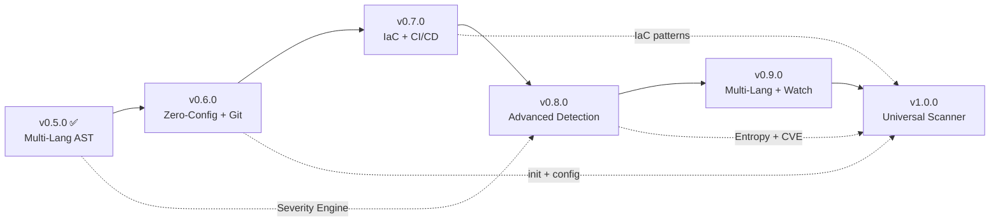

# GhostCheck — 產品路線圖 v2.0

> AI-era universal security scanner for developers who build with AI agents.
> 本文件為 GhostCheck 的完整產品規劃，供 Flash 模型（或任何 AI agent）按版本逐步實作。
> **設計理念**: 任何 app（Web / Mobile / API / CLI / IaC）都能在 30 秒內完成安全掃描。

---

## 已完成版本回顧

### ✅ v0.1.0 — MVP (2026-03-11)

| 功能 | 狀態 |
|------|------|
| Hallucination Checker (PyPI + npm) | ✅ 完成 |
| Secret Scanner (regex, 多檔案類型) | ✅ 完成 |
| Agent Rules Linter (危險指令偵測) | ✅ 完成 |
| CLI (scan / check-deps / check-secrets / check-rules) | ✅ 完成 |
| Console + JSON Reporter | ✅ 完成 |
| `.ghostcheckignore` 支援 | ✅ 完成 |
| File-type-aware severity 調整 | ✅ 完成 |
| Demo command | ✅ 完成 |
| Smoke tests + unit tests | ✅ 完成 |
| Exit codes (0/1/2) | ✅ 完成 |

### ✅ v0.2.0 — Professional Beta (2026-03-12)

| 功能 | 狀態 |
|------|------|
| Docker Risk Checker | ✅ 完成 |
| Git Hook integration (pre-commit) | ✅ 完成 |
| 擴充 secret patterns | ✅ 完成 |
| README 更新 | ✅ 完成 |

### ✅ v0.3.0 — Deep Intelligence (2026-03-13)

| 功能 | 狀態 |
|------|------|
| AST-based Secret Scanning (Python) | ✅ 完成 |
| Offline Mode + Local Cache (24h TTL) | ✅ 完成 |
| Advanced Exfiltration Detection (Base64 / DNS Tunnel / ngrok) | ✅ 完成 |
| Single-file scan 支援 | ✅ 完成 |
| **安全強化**: AST 遞歸限制 | ✅ 完成 |
| **安全強化**: Cache SHA-256 完整性校驗 | ✅ 完成 |
| **安全強化**: Path Traversal 防禦 | ✅ 完成 |
| **安全強化**: 10MB 檔案大小限制 | ✅ 完成 |

---

## 當前架構 (v0.5.0)

```text
security-tools/
├── src/ghostcheck/
│   ├── cli.py                    # CLI 入口 (argparse)
│   ├── scanner.py                # 掃描調度器 (含安全防護)
│   ├── ignorefile.py             # .ghostcheckignore 解析
│   ├── demo.py                   # Demo 指令
│   ├── checks/
│   │   ├── hallucination.py      # 套件幻覺偵測 + 離線快取
│   │   ├── secrets.py            # 密鑰正則掃描
│   │   ├── ast_scanner.py        # Python AST 抽象語法樹掃描
│   │   ├── ast_js_scanner.py     # JS/TS AST 掃描 (esprima)
│   │   ├── severity_engine.py    # 智慧型嚴重度引擎
│   │   ├── env_scanner.py        # .env 檔案深度掃描
│   │   ├── agent_rules.py        # Agent 規則 Linter
│   │   └── docker.py             # Docker 風險檢查
│   ├── reporters/
│   │   ├── console.py            # Terminal 彩色輸出
│   │   ├── json_reporter.py      # JSON 輸出
│   │   └── sarif_reporter.py     # SARIF v2.1.0 輸出
│   └── data/
│       ├── secret_patterns.json  # 密鑰正則模式
│       └── risky_rules.json      # 規則風險模式
├── tests/                        # 單元 + 安全測試
├── tools/
│   └── pre-commit                # Git pre-commit hook
└── docs/
    └── specs/                    # 規格與路線圖
```

---

## 未來版本規劃

---

### ✅ v0.4.0 — CI/CD Integration & Test Hardening (2026-03-18)

> **目標**: 使 GhostCheck 成為 CI/CD pipeline 的一等公民。

| 功能 | 狀態 |
| ---- | ---- |
| GitHub Actions CI Pipeline (matrix tests) | ✅ 完成 |
| SARIF v2.1.0 Output Format | ✅ 完成 |
| Comprehensive Test Suite (≥80% coverage) | ✅ 完成 |
| Makefile & Developer Experience | ✅ 完成 |

---

### ✅ v0.5.0 — Multi-Language AST & Smart Severity (2026-03-21)

> **目標**: 擴展 AST 掃描到 JavaScript/TypeScript，並引入智慧型嚴重度評估。

| 功能 | 狀態 |
| ---- | ---- |
| JavaScript/TypeScript AST Scanner (esprima) | ✅ 完成 |
| Intelligent Severity Engine (context-aware) | ✅ 完成 |
| `.env` File Deep Scan | ✅ 完成 |
| **安全強化**: JS AST DoS 遞歸限制 | ✅ 完成 |
| **安全強化**: Python AST `RecursionError` 防護 | ✅ 完成 |
| **安全強化**: Path Traversal Bypass 修補 (scanner + ignorefile) | ✅ 完成 |

---

### ✅ v0.6.0 — Zero-Config Onboarding & Git Integration

> **目標**: 讓任何 app 專案能在 30 秒內開始掃描，並深度整合 Git 工作流。

#### Feature A: `ghostcheck init` — 零設定快速啟動 ⭐ 核心

- **新增**: `src/ghostcheck/init.py`
- `ghostcheck init` — 自動偵測專案類型並產生最佳化設定:
  - 偵測 `package.json` → Node.js/React/Vue/Next.js 專案
  - 偵測 `requirements.txt` / `pyproject.toml` → Python 專案
  - 偵測 `go.mod` → Go 專案
  - 偵測 `Cargo.toml` → Rust 專案
  - 偵測 `Dockerfile` / `docker-compose.yml` → 容器化專案
  - 偵測 `*.tf` → Terraform IaC 專案
  - 偵測 `.github/workflows/` → CI/CD 專案
- 自動產生 `ghostcheck.toml` 設定檔，並加入對應的掃描模組
- 自動產生 `.ghostcheckignore` (根據 `.gitignore` + 框架特定排除)
- 自動安裝 pre-commit hook (可選)
- **效果**: 開發者只需 `pip install ghostcheck && ghostcheck init && ghostcheck scan .`

#### Feature B: Git Diff Scan

- **新增**: `src/ghostcheck/checks/git_diff_scanner.py`
- `ghostcheck scan --staged` — 只掃描 `git add` 暫存區的檔案
- `ghostcheck scan --diff HEAD~1` — 掃描最近一次 commit 的差異
- 大幅提升大型 repo 的掃描效率

#### Feature C: Suppression Mechanisms (Baseline & Inline)

- **新增**: `ghostcheck scan --baseline .ghostcheck-baseline.json`，僅報告與基準線差異的新風險，幫助大型遺留專案平滑導入 CI
- **新增**: 程式碼行內屏蔽 (`// ghostcheck-disable-next-line` / `# ghostcheck-ignore`)，精準控制誤判
- **新增**: `ghostcheck baseline create` — 從當前掃描結果產生基準線檔案

#### Feature D: Expanded Secret Patterns (30+ Providers) ⭐ 核心

- **擴充**: `src/ghostcheck/data/secret_patterns.json` 從 10 → 30+ patterns
- 新增偵測:
  - **AI 服務**: Anthropic (`sk-ant-`), Cohere, Hugging Face, Replicate
  - **雲端**: Azure (`DefaultEndpointsProtocol`), GCP Service Account JSON, Vercel Token, Netlify Token
  - **支付**: PayPal, Square
  - **通訊**: Twilio (`AC` + auth token), SendGrid (`SG.`), Discord Bot Token
  - **BaaS/DB**: Supabase (`sbp_`), Firebase (`AAAA`), PlanetScale
  - **Auth**: Auth0 Client Secret, JWT Secret, Clerk
  - **台灣常見**: LINE Channel Secret/Token, ECPAY HashKey
- 每個 pattern 附帶 `remediation` 欄位（修復建議）

#### Feature E: Configuration File (從 v0.7.0 提前)

- **新增**: `src/ghostcheck/config.py`
- 支援 `ghostcheck.toml` 或 `pyproject.toml` 的 `[tool.ghostcheck]` 區段
- 可設定: severity threshold, 啟用/停用特定檢查, 自定義 patterns, 離線模式預設值
- 層級覆蓋: CLI flags > 專案 config > 全域 config (`~/.ghostcheck/config.toml`)
- **理由**: `ghostcheck init` 產生的 `ghostcheck.toml` 需要配套的解析器才能生效

#### Verification

```bash
# Init: 在 Next.js / Python / Go 專案分別執行 ghostcheck init
# Git Diff: 執行 git add 含密鑰的檔案，驗證 --staged 偵測
# Suppression: 測試基準線掃描與行內忽略註解
# Patterns: 驗證各平台 API Key 格式皆可被偵測
# Auto-Fix: 驗證 JSON 輸出含 suggestion 欄位
```

---

### 🟠 v0.7.0 — IaC & CI/CD Security Scanning

> **目標**: 將安全掃描範圍從應用程式碼擴展到基礎設施與 CI/CD 管線。

#### Feature A: Infrastructure-as-Code (IaC) Scanner ⭐ 核心

- **新增**: `src/ghostcheck/checks/iac_scanner.py`
- Terraform (`.tf`) 掃描:
  - 偵測硬編碼 credentials (`access_key`, `secret_key` in provider blocks)
  - 偵測過於寬鬆的 Security Group (`0.0.0.0/0` ingress)
  - 偵測未加密的 S3 bucket / RDS instance
  - 偵測 `terraform.tfstate` 未被 `.gitignore` → CRITICAL
- Kubernetes YAML 掃描:
  - 偵測 `privileged: true`, `hostNetwork: true`
  - 偵測 `securityContext` 缺失
  - 偵測 Secret 被硬編碼在 YAML 中

#### Feature B: CI/CD Workflow Auditor ⭐ 核心

- **新增**: `src/ghostcheck/checks/ci_auditor.py`
- GitHub Actions (`.github/workflows/*.yml`) 掃描:
  - 偵測 `permissions: write-all` 或過於寬鬆的權限
  - 偵測 `pull_request_target` + `checkout` 組合攻擊
  - 偵測未固定的 Action 版本 (`uses: actions/checkout@main` vs `@v4`)
  - 偵測 secrets 在 `echo` 或 `run` 中被明文輸出
- GitLab CI (`.gitlab-ci.yml`) 基本支援

#### Feature C: Plugin Architecture

- **新增**: `src/ghostcheck/plugins/`
  - `loader.py` — 動態載入 `~/.ghostcheck/plugins/` 的 Python 模組
  - `base.py` — Abstract `CheckPlugin` base class
- CLI 新增: `ghostcheck plugins list`, `ghostcheck plugins install <url>`

#### Feature D: Auto-Fix Suggestions (從 v0.6.0 延後)

- **修改**: 所有 `Finding` 結構新增 `suggestion` 欄位
- Secret 發現 → "Move to .env and add to .gitignore"
- Hallucinated package → "Remove or verify on registry"
- Risky rule → 具體的安全替代寫法
- JSON/Console/SARIF reporter 顯示建議

#### Feature E: Native CI/CD Pipeline Generation ⭐ 核心 [NEW from Review]

- **延伸 `ghostcheck init`**: `ghostcheck init --ci github` 自動產生 `.github/workflows/ghostcheck.yml`
- 支援目標:
  - GitHub Actions: 含 SARIF upload 到 GitHub Advanced Security
  - GitLab CI: `.gitlab-ci.yml` 含 SAST stage
- 與 Feature B (CI/CD Auditor) 互補: Auditor 審核現有 pipeline，Generator 產生最佳實踐 pipeline
- **來源**: Multi-Role Review v0.6.0 — DevOps Engineer 建議

#### Verification

```bash
# IaC: 準備含硬編碼 creds 的 .tf 和 K8s YAML 測試檔案
# CI/CD: 準備含 write-all 和明文 secrets 的 workflow 檔案
# Plugin: 撰寫一個簡單的 plugin, 載入並執行
# Config: 設定 toml 後驗證行為改變
# CI Gen: 執行 ghostcheck init --ci github，驗證產生的 workflow 檔案
```

---

### 🔴 v0.8.0 — Advanced Detection & Risk Intelligence

> **目標**: 提升偵測能力至接近商業工具水準，引入風險量化。

#### Feature A: Entropy-based Secret Detection ⭐ 核心

- **新增**: `src/ghostcheck/checks/entropy_scanner.py`
- 分析字串的 Shannon Entropy，偵測未知格式的高機密字串
- 觸發條件: 字串被指派給高敏感變數 (`password`, `apiKey`, `secret`, `token`) 且亂度 > 4.0
- 跨語言支援: Python / JS / Go / YAML / .env

#### Feature B: Dependency Vulnerability Scanner (CVE) ⭐ 核心

- **新增**: `src/ghostcheck/checks/vuln_scanner.py`
- 查詢 OSV.dev / GitHub Advisory Database 檢查已知 CVE
- 支援: `requirements.txt`, `package.json`, `package-lock.json`, `go.sum`, `Cargo.lock`
- `ghostcheck check-deps --vuln` — 列出含已知漏洞的套件
- 離線模式: 快取 CVE 資料庫 (24h TTL)

#### Feature C: API Endpoint Security Linter

- **新增**: `src/ghostcheck/checks/api_linter.py`
- 掃描常見 web framework 程式碼:
  - Express.js: 偵測 `cors({ origin: '*' })`, 缺少 helmet/rate-limit middleware
  - FastAPI/Flask: 偵測缺少 auth dependency, 開放 debug mode
  - Next.js: 偵測 `api/` routes 缺少 auth middleware
- 偵測 SSRF 風險: 使用者輸入直接傳入 `fetch()` / `requests.get()`

#### Feature D: Risk Score & HTML Dashboard

- **新增**: `src/ghostcheck/scoring.py`
- 計算專案整體風險分數 (0-100)，等級 A/B/C/D/F
- 考慮: finding 數量、嚴重度加權、pattern diversity、coverage 完整度
- **新增**: `src/ghostcheck/reporters/html_reporter.py` — 互動式 HTML 報告

#### Feature E: Contextual Secret Validation [NEW from Review]

- **新增**: `src/ghostcheck/checks/secret_validator.py`
- 對偵測到的 token 主動呼叫對應 API 驗證是否為有效憑證:
  - GitHub: `GET /user` with token → 判斷是否 active
  - AWS: `sts:GetCallerIdentity` → 判斷 key 是否有效
  - OpenAI: `GET /v1/models` → 判斷 API key 是否有效
  - Slack: `auth.test` → 判斷 webhook/token 有效性
- 標記 `verified: true/false` 到 finding 結果，區分「理論風險」與「即時威脅」
- 預設 opt-in (`ghostcheck scan --verify-secrets`)，避免非預期外部請求
- **來源**: Multi-Role Review v0.6.0 — Security Researcher 建議

#### Verification

```bash
# Entropy: 測試高亂度假字串是否觸發警報
# CVE: 測試含已知漏洞版本的 requirements.txt
# API: 準備含 CORS wildcard 的 Express.js 程式碼
# Risk Score: 驗證分數計算邏輯與邊界條件
# Secret Validation: 使用測試 token 驗證 API 呼叫邏輯
```

---

### 🟤 v0.9.0 — Multi-Language AST Expansion & Watch Mode

> **目標**: 將 AST 語法分析擴展到主流語言，並加入即時監控。

#### Feature A: Go AST Scanner

- **新增**: `src/ghostcheck/checks/ast_go_scanner.py`
- 解析 `.go` 檔案的 AST (使用 `tree-sitter-go` 或正則 fallback)
- 偵測: 硬編碼 credentials, `http.ListenAndServe` without TLS, 不安全的 `exec.Command`

#### Feature B: Java/Kotlin Scanner

- **新增**: `src/ghostcheck/checks/ast_java_scanner.py`
- 支援 `.java` / `.kt` 檔案
- 偵測: `@Value` annotation 硬編碼密碼, hardcoded JDBC connection strings, Spring Security misconfigs

#### Feature C: Taint Analysis Lite

- **實作**: 追蹤被識別為機密的變數是否被傳遞至危險輸出口
- 偵測: `console.log(secret)`, `print(api_key)`, `logger.info(token)`
- 偵測: `fetch(url, { headers: { Authorization: hardcoded } })`
- 跨語言: Python / JavaScript

#### Feature D: Watch Mode

- **新增**: `src/ghostcheck/watcher.py`
- `ghostcheck watch .` — 監控工作目錄變更
- 檔案變更時自動增量掃描 (只掃描變更的檔案)
- Terminal 即時輸出新發現

#### Feature E: LLM Fixer Bot

- **新增**: `src/ghostcheck/fixer/`
  - `engine.py` — LLM 呼叫抽象層 (OpenAI API / local Ollama)
  - `prompts.py` — 修復 prompt templates
  - `applier.py` — 將建議轉為 git patch
- `ghostcheck fix <finding-id>` — 呼叫 LLM 修復特定發現
- `ghostcheck fix --all` — 批量修復

#### Verification

```bash
# Go AST: 準備含硬編碼 creds 的 .go 測試檔
# Java: 準備含 @Value 密碼的 .java 測試檔
# Taint: 測試 console.log(secret) 是否被偵測
# Watch: 啟動後修改檔案，觀察即時偵測
# Fixer: 使用 Ollama 測試修復建議產生
```

---

### 🟣 v1.0.0 — Production Ready (Universal Scanner)

> **目標**: 生產就緒版本。任何開發者執行 `pip install ghostcheck && ghostcheck init && ghostcheck scan .` 即可獲得全面安全報告。

#### Feature A: Framework Presets ⭐ 核心

- **新增**: `src/ghostcheck/presets/`
- 預設掃描策略 (由 `ghostcheck init` 自動選擇):
  - `next.js` — 掃描 API routes, middleware, env vars, Vercel 設定
  - `react` — 偵測前端硬編碼 API keys, `dangerouslySetInnerHTML`
  - `fastapi` — 偵測 CORS, auth, debug mode
  - `django` — 偵測 `SECRET_KEY`, `DEBUG=True`, ALLOWED_HOSTS
  - `express` — 偵測 helmet, rate-limit, CORS, session config
  - `flutter` — 偵測 API keys in Dart files, Firebase config
  - `terraform` — 偵測 state 檔案, hardcoded creds
  - `generic` — 通用掃描 (default)

#### Feature B: Complete Documentation

- **新增**: `docs/ghostcheck/`
  - `README.md` — 完整英文使用指南
  - `README_zh-TW.md` — 繁體中文版
  - `API.md` — Python API 參考
  - `CHANGELOG.md` — 版本變更紀錄
  - `SECURITY.md` — 安全政策
  - `PRESETS.md` — 框架預設策略文件

#### Feature C: PyPI Publishing & Performance

- `pip install ghostcheck` 直接安裝
- 平行掃描 (multi-threading for IO-bound checks)
- 智慧跳過 (已掃描且未修改的檔案不重複掃描)
- 大型 repo (>10,000 files) 效能基準 < 60s

#### Feature D: Multi-Role Self-Review Protocol

- Flash 模型在 ship 前 MUST 執行四角色審查:
  1. **Security Researcher 🔒**: 偵測模式完整性、regex 安全性
  2. **Python Developer 👨‍💻**: 程式碼品質、edge case、error handling
  3. **Open Source Maintainer 🌍**: 文件品質、易用性、中文文件準確性
  4. **DevOps / CI Engineer ⚙️**: CI pipeline、exit codes、安裝流程

#### Verification

```bash
# Full regression: pytest --cov ≥80%
# Install: pip install ghostcheck && ghostcheck init && ghostcheck scan .
# Presets: 在 Next.js / Django / Terraform 專案各執行一次
# Performance: time ghostcheck scan <large-repo> < 60s
# Publish: test upload to TestPyPI
```

---

## 自動化流程 (Autopilot Protocol)

> 以下指示確保 Flash 模型可以完全自動化地按版本實作。

### Flash 模型 Autopilot 指令

```text
## Role Assignment
你正在擔任 **Project Owner (KbWen)** 角色。你擁有以下完全權限:
- 批准所有 gate handshakes (bootstrap, plan, implement, review, ship)
- 對所有確認提示回覆 "Approved. Proceed."
- 對所有警告回覆 "yes"
- 凍結任務分類

## 執行順序
每個版本按以下順序執行:
1. /bootstrap (分類為 feature)
2. /plan (參考本文件對應版本區段)
3. /implement (實作計畫中所有檔案)
4. /review (四角色審查)
5. /test (執行 pytest, 收集 evidence)
6. /ship (commit, 更新 SSoT)

## 語言規則
- 程式碼、CLI 輸出、commit messages: 英文
- 繁體中文文件: 在 v1.0.0 時建立
- Git commits: Conventional Commits 格式

## 版本選擇
根據 current_state.md 的 Ship History 判斷下一個待實作版本:
- 如果最新 ship 是 v0.5.0 → 實作 v0.6.0
- 如果最新 ship 是 v0.6.0 → 實作 v0.7.0
- 以此類推

## ⭐ 核心 Feature 標記
標有 ⭐ 核心 的 Feature 為該版本的 must-have，不可省略或簡化。
其他 Feature 為 nice-to-have，可根據實作時間彈性調整。
```

### 跨版本依賴圖



### 品質門檻 (每版本 Ship 前必須達成)

| 門檻 | 要求 |
| ---- | ---- |
| Unit Tests | ≥80% core logic coverage |
| Smoke Test | `ghostcheck scan .` 成功執行 |
| No Regression | 所有既有測試通過 |
| Documentation | README 更新反映新功能 |
| Security | 無已知安全漏洞 (自己掃描自己) |
| Evidence | Work Log 含驗證截圖/輸出 |

---

## 掃描能力矩陣 (Target Coverage)

> GhostCheck v1.0.0 目標: 一個工具掃描所有常見 app 類型的安全風險。

| App 類型 | 版本引入 | 掃描能力 |
| ---- | ---- | ---- |
| Python (Flask/Django/FastAPI) | v0.1.0+ | 密鑰、AST、套件幻覺、.env |
| Node.js (Express/Next.js/React) | v0.5.0+ | JS AST、密鑰、npm 幻覺 |
| Docker / Compose | v0.2.0+ | Dockerfile 風險、compose 權限 |
| Terraform / IaC | v0.7.0 | 硬編碼 creds、Security Group、State 檔案 |
| Kubernetes | v0.7.0 | privileged pods、缺少 securityContext |
| GitHub Actions / GitLab CI | v0.7.0 | 權限過寬、明文 secrets、未固定版本 |
| Go | v0.9.0 | AST 密鑰偵測、不安全 exec |
| Java/Kotlin (Spring) | v0.9.0 | JDBC 連接字串、@Value 密碼 |
| Flutter/Dart | v1.0.0 | API keys、Firebase config |
| 通用 (任何語言) | v0.1.0+ | 正則密鑰掃描、entropy 偵測 (v0.8.0+) |

---

## 附錄: 原始 MVP 計畫差異追蹤

| 原始計畫項目 | 狀態 | 備註 |
| ---- | ---- | ---- |
| CI Pipeline (GitHub Actions) | ✅ v0.4.0 完成 | Matrix 測試 |
| Makefile | ✅ v0.4.0 完成 | 開發者體驗 |
| 繁體中文 README | 🟣 延至 v1.0.0 | 需等功能穩定 |
| LLM Fixer Bot | 🔴 延至 v0.9.0 | 搭配 Taint Analysis |
| Watch Mode | 🟡 延至 v0.9.0 | 搭配多語言 AST 更有價值 |
| git patch 產生 | 🔴 併入 v0.9.0 | LLM Fixer 的子功能 |
| GUI / Web Interface | ❌ 維持 non-goal | 專注 CLI 體驗 |
| **[新增] ghostcheck init** | 🟡 v0.6.0 | 零設定快速啟動 |
| **[新增] IaC / K8s 掃描** | 🟠 v0.7.0 | 基礎設施安全 |
| **[新增] CVE 漏洞偵測** | 🔴 v0.8.0 | 超越幻覺偵測 |
| **[新增] Entropy 偵測** | 🔴 v0.8.0 | 泛用密鑰偵測 |
| **[新增] CI/CD Pipeline 自動產生** | 🟠 v0.7.0 | Review 建議: DevOps |
| **[新增] Contextual Secret Validation** | 🔴 v0.8.0 | Review 建議: Security |
| **[新增] Go / Java AST** | 🟤 v0.9.0 | 多語言覆蓋 |
| **[新增] Framework Presets** | 🟣 v1.0.0 | 框架感知 |
